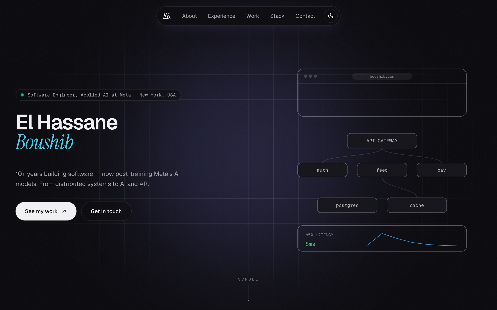
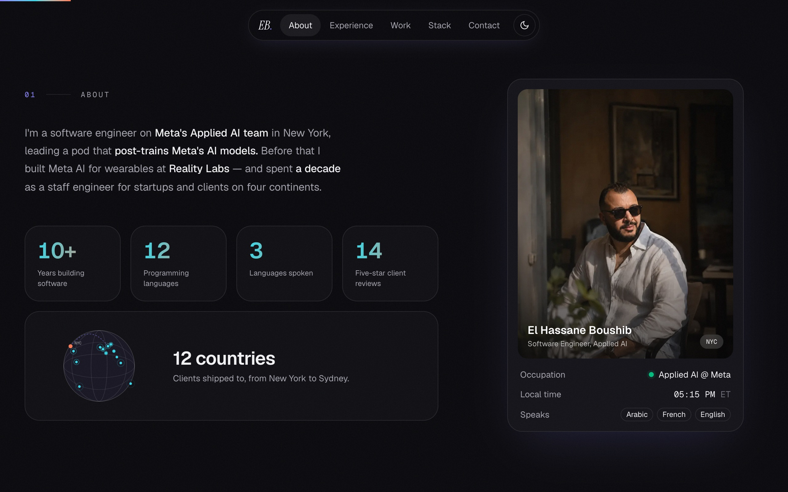
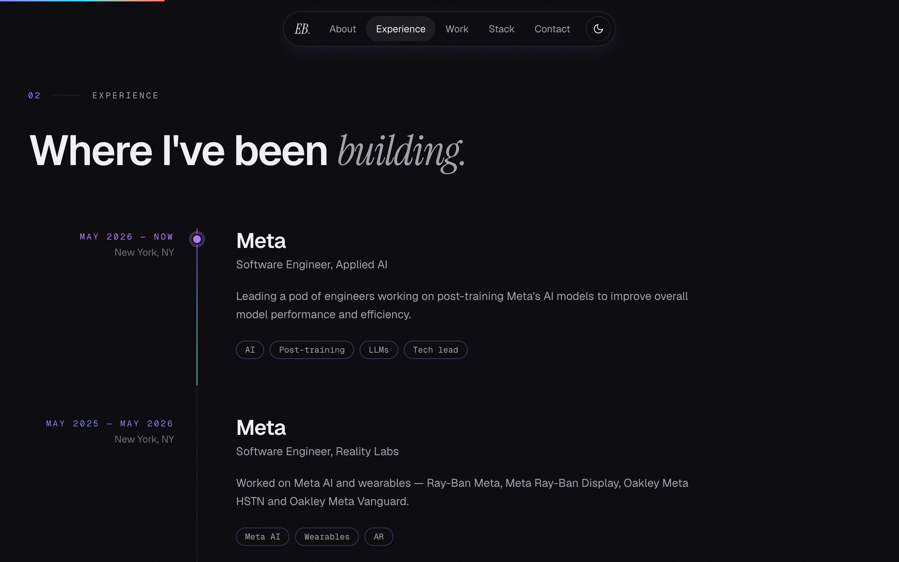
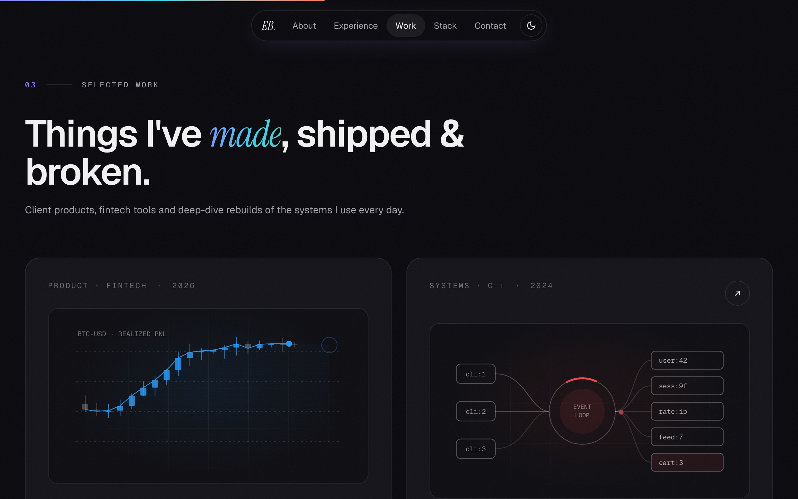

<div align="center">

# El Hassane Boushib — Portfolio

**My personal site: animated system diagrams, a 3D hero, project illustrations and a light/dark theme.**

[](https://nextjs.org)
[](https://react.dev)
[](https://www.typescriptlang.org)
[](https://tailwindcss.com)
[](https://r3f.docs.pmnd.rs)
[](https://motion.dev)
[](https://pnpm.io)
[](LICENSE)
<br />
[](https://github.com/boushib/portfolio-2026/commits/main)
[](https://github.com/boushib/portfolio-2026)
[](https://github.com/boushib/portfolio-2026)



</div>

## Screenshots

**About:** animated stat badges, a globe of client countries and a profile card with live New York time



**Experience:** a timeline of roles



**Work:** each project has its own animated illustration



## About

A single-page portfolio built with **Next.js 16** (App Router), **React 19**, **TypeScript** and **Tailwind CSS 4**. The hero cycles through animated system diagrams (a request journey, a deploy pipeline, autoscaling under load), and the 3D scenes run on **Three.js** through React Three Fiber.

The diagrams, stat badges and project illustrations are hand-drawn SVG animated with SMIL. They only play while on screen and hold a finished frame when the OS "reduce motion" setting is on.

## Features

- **Hero:** animated architecture scenes that crossfade in a loop, with live-looking metrics
- **About:** animated stat badges, a client globe and a profile card with local time
- **Experience:** a timeline of roles with tags
- **Work:** project cards, each with a custom animated illustration
- **Stack:** the languages and tools I use, with logos
- **Testimonials** from clients
- **Contact:** a form with topics and validation
- **Light and dark themes**, applied before first paint so the page never flashes the wrong one
- Smooth scrolling (Lenis), section-aware navigation and a reading progress bar

## Getting started

Requires Node.js 20.9+ and pnpm.

```bash
pnpm install
pnpm dev
```

Open [http://localhost:3000](http://localhost:3000).

| Script | What it does |
| --- | --- |
| `pnpm dev` | Dev server |
| `pnpm build` / `pnpm start` | Production build and server |
| `pnpm lint` | ESLint |

Content (profile, experience, projects, testimonials) lives in `src/lib/data.ts`.

> The contact form validates and shows its sent state, but isn't connected to a backend yet. Wire `submitContact` in `src/lib/contact.ts` to an API route or a form service to receive messages.

## Project structure

```
src/
  app/                 Layout, global styles and the home page
  components/          Sections: Hero, About, Experience, Work, Stack, Testimonials, Contact
  components/hero/     Animated architecture scenes
  components/work/     Project illustrations
  components/about/    Stat badges and About layouts
  components/three/    3D scenes (React Three Fiber)
  lib/                 Site data and hooks (theme, in-view, SMIL playback, local time)
public/                Photos, logos, flags, 3D models and the HDR environment
```

## License

[MIT](LICENSE) © El Hassane Boushib
